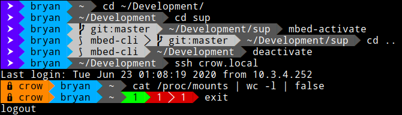
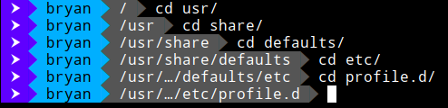

# sup
Go PS1 Status Updater

[](https://goreportcard.com/report/github.com/DataDrake/sup) []()

## Motivation

The prompt is a good place for contextual information, but other tools were slow. So I wrote this instead!

This work was inspired by the venerable [Powerline](https://github.com/powerline/powerline), but does not share any code.

## Goals

 * Spin up and down as fast as reasonable
 * A+ Rating on [Report Card](https://goreportcard.com/report/github.com/DataDrake/sup)
 
## Screenshots

#### Context-Sensitive Status Reporting:


#### Working Directory Truncation:

 
## Reported Information

* SSH Hostname
* Username
* Python Virtual Environment
* Version Control
  * SVN
  * Git (with Branch)
* Working Directory
* Exit codes (including pipelines)

## Requirements

#### Compile-Time
* Go 1.14 (tested)
* Make

#### Runtime
* [powerline-fonts](https://github.com/powerline/fonts) for special glyphs
* VCS/SCM Reporting:
  * (Optional) Git
  * (Optional) Subversion

## Installation

1. Clone repo and enter its directory
2. `make`
3. `sudo make install`

## Usage

### Bash
Add the following line **exactly** to your `bashrc`:
```
source /usr/share/sup/bash.sh
```
Reload your `bashrc` or open a new terminal. Enjoy!

### Zsh
Add the following line **exactly** to your `zshrc`:
```
source /usr/share/sup/sup.zsh
```
Reload your `zshrc` or open a new terminal. Enjoy!

### Themes
There is currently limited theming support which you may enable by setting an environment variable, e.g."
```
export SUP_THEME=warm
```
Where `warm.json` in the themes directory corresponds with the desired theme.

See the examples in:
```
/usr/share/sup/themes/
```

## License
 
Copyright 2021 Bryan T. Meyers <root@datadrake.com>
 
Licensed under the Apache License, Version 2.0 (the "License");
you may not use this file except in compliance with the License.
You may obtain a copy of the License at
 
http://www.apache.org/licenses/LICENSE-2.0
 
Unless required by applicable law or agreed to in writing, software
distributed under the License is distributed on an "AS IS" BASIS,
WITHOUT WARRANTIES OR CONDITIONS OF ANY KIND, either express or implied.
See the License for the specific language governing permissions and
limitations under the License.
